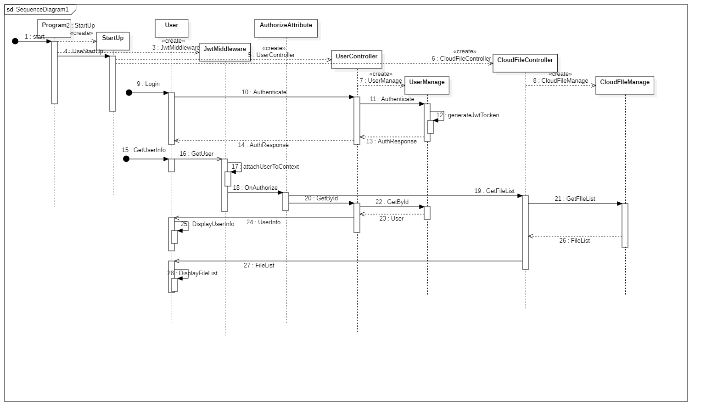
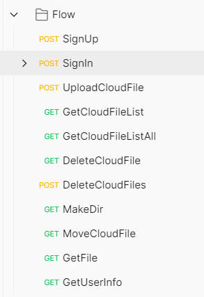

# 云存储平台项目后端

基于asp.net 的云存储平台后端

前端仓库地址：https://gitee.com/pengkuang/Cloud_Disk_front

## 项目架构设计

### 用例图

### 类图

### 顺序图

## 设计模式

1. MVVM 的设计模式。

   

   项目前端使用 Vue.js 框架实现。

   **MVVM模式**是工程师在解决WPF应用程序开发复杂度时提出的解决方案，它实现了**View和Model的自动同步**，开发者不需要再手动的绑定输入监听和手动的将数据结果展示在view上，这就是**双向数据绑定的优势**，后来Backbone、Vue等都是MVVM模式的前端框架。

   ViewModel解决了View和Model之间转换的开发效率问题。 但是ViewModel内部的复杂度又变成了新的问题，其中一个问题就是**双向数据绑定劣势**。在双向数据绑定中，Model（可以理解为状态的集合） 中可以修改自己或其他Model的状态， 用户的操作（如在输入框中输入内容）也可以修改状态。这使的改变一个状态有可能会触发一连串的状态的变化，最后**很难预测最终的状态**是什么样的。使得代码变得很难调试。

   为了解决这个问题便有了后来的Vue **单向数据流**的解决方案-Vuex。 在复杂度较高的业务上使用单向数据流来解耦View和Model的关系。

2. 观察者模式

   前端中，父组件与子组件间使用了观察者模式设计的信号机制进行数据通信。

   子组件通过emit 释放信号

   

   父组件订阅子组件的事件，绑定事件的处理函数（观察者）

   

   

3.  访问者模式

   在存储平台后端，接口的访问需要根据访问者是否带有合法身份验证信息（Token），对接口的访问权限进行限制，并且对于带有合法身份验证信息的访问者，控制器会根据其信息找到对应的用户进行操作，这样接口的执行算法就会随着访问者的改变而改变，将数据结构与数据操作分离。

   需要进行身份验证的接口会带有 Authorize 的 Attribute

   

   根据访问者Token计算出对应的用户，将其添加到http context 中，以供服务类根据访问者进行相应的数据操作。

   

   

4.  代理模式

   在后端，为了解耦，使软件结构更加高效，Service 业务逻辑层的各个类并不会直接访问数据库操作数据，而是使用增加了UserContext 模型层对数据库的操作进行了封装代理，向外提供了更加方便的接口，供业务逻辑层调用。

5. 外观模式

   后端中对外提供接口的Controller 若直接对模型层进行调用显然过于繁琐，提高了系统的复杂程度。因此增加了Service业务逻辑层，将各个可能的业务请求进行了整合，向外提供了高层的接口，使得Controller能够仅通过一次调用就完成必要的业务处理。

   综上后端项目将系统划分为了 Controller，Service，Model三个层级，通过逐级的封装使各个模块都有了他们相对独立和完整的功能分工，这样也可以简化后续开放中对于项目的扩展、修改。项目结构如下：

   

## 后端Web API测试

使用Postman进行测试，主要API如下：

其中登录API采用Tocken进行便捷的身份验证，请求与返回结果如下：

其他需要身份验证的请求需要在http请求头中附上登录时获取的Tocken，如下：

其余API类同，不再逐一展示。

## 运行效果

### 登录界面

### 注册界面

### 云盘主页面

支持文件目录的切换、文件上传下载、文件在线预览，文件删除、移动、重命名，文件夹创建等功能

### 云盘信息页面

动态展示用户剩余空间（默认初始分配1GB空间）以及用户基本信息。